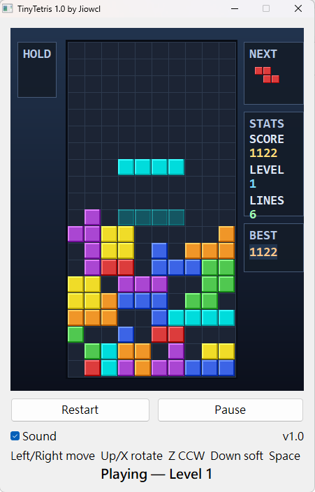

# TinyTetris

A tiny Tetris game written in PureBasic.  

## Environment

- Windows 11 above (recommend)
- PureBasic 6.40 above (recommend)

## How to Build

Open `TinyTetris/TinyTetris.pbp` in PureBasic, or compile `TinyTetris/TinyTetris.pb` to `TinyTetris/Output/TinyTetris.exe`.

Module features require PureBasic 5.20 and above. Enable Unicode and save sources as UTF-8 with BOM.

## How to Play

| Key | Action |
|-----|--------|
| Left / Right | Move |
| Up / X | Rotate clockwise |
| Z | Rotate counter-clockwise |
| Down | Soft drop |
| Space | Hard drop |
| C / Shift | Hold |
| P | Pause |
| R | Restart |

Buttons: **Restart**, **Pause**, **Sound**, **Music**. Preferences (SFX, BGM, high score, DAS) are stored in `TinyTetris.ini` next to the executable.

## Features

- 10×20 playfield (2 hidden spawn rows)
- 7 tetrominoes with simple wall kicks
- 7-bag randomizer, Next queue ×3, Hold (dimmed when used)
- Ghost piece, soft / hard drop with drop trail
- Tunable DAS/ARR (`DasDelay` / `DasRepeat` in `TinyTetris.ini`)
- Lock delay with reset limit (15), lock flash, grounded pulse
- Line-clear flash → stack fall animation → spawn delay
- Clear particles, level-up banner
- Nintendo-style scoring and level speed-up
- Optional WAV SFX + tracker BGM (`bgm.xm` / `.it` / `.mod` / `.wav` under `Sound/`)
- Music pause-duck and game-over fade-out; missing BGM file is skipped safely

## License

Copyright (c) 2026 Ji-Feng Tsai.  
Copyright (c) 効果音ラボ.  
Copyright (c) PANICPUMPKIN.  
Code released under the MIT license.  

Icon: [AI Icon Generator](https://perchance.org/ai-icon-generator)  

## Donation  

If this application help you reduce time to coding, you can give me a cup of coffee :)

[Paypal Me](https://paypal.me/jiowcl?locale.x=zh_TW)
